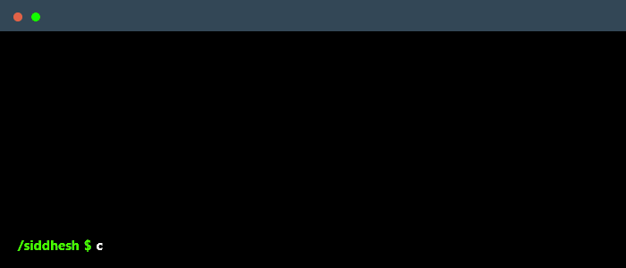

<!DOCTYPE html>
<html>
<head>
  

        
    

</head>
<body>
    <h1 align="center">👋 Hello, I'm Siddhesh Chaubal!</h1>
      

        
    

  

    
  

    <h2>🚀 My Mission </h2>
    

        Passionate about building scalable and efficient web applications, I strive to create impactful digital experiences. 
        With expertise in <strong>full-stack development</strong>, cloud computing, and fintech solutions, I am committed to continuous learning and innovation.
    

    

        
    

    <h2>🔗 Connect with Me</h2>

    
    
    <!--  -->

    <h2>💡 Skills & Interests</h2>
    <ul>
        <li>Full-Stack Web Development (React.js, JavaScript, C# .NET, Node.js, AWS)</li>
        <li>Cloud Computing & DevOps</li>
        <li>FinTech & Financial Markets (CFA Level I Cleared)</li>
        <li>Software Engineering & Cybersecurity</li>
    </ul>
    <h2>📌 Featured Projects</h2>
    <ul>
        <li><strong>Memora:</strong> A flashcards web app built with React, AWS, and Node.js.</li>
        <li><strong>More projects coming soon...</strong></li>
    </ul>
    <h2>📫 Get in Touch</h2>
    

        Feel free to reach out via LinkedIn or explore my projects on GitHub. Let's collaborate and build something amazing! 🚀
    

<h2>📂 For Employers:</h2>

Get my resume here:

<a href="https://drive.google.com/file/d/1HchuFhm3uRoHTMos11clGXZ4L983XK-0/view?usp=sharing" download style="display: flex; align-items: center; gap: 10px; text-decoration: none; font-size: 18px; font-weight: bold; color: #0073e6;">
    
    Download My Resume
</a>
    

        
    

</html>
