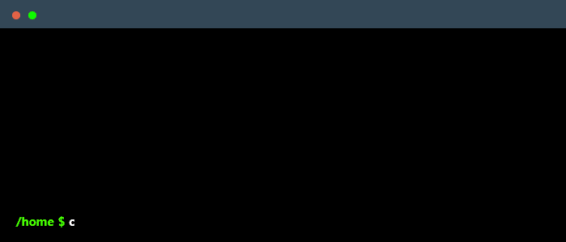

<!DOCTYPE html>
<html>
<head>
  

        
    

</head>
<body>
    <h1 align="center">👋 Hello, I'm Siddhesh Chaubal!</h1>
      

        
    

  

    
  

    <h2>🚀 Summary </h2>
    

      Full stack developer with frontend focus, specializing in JavaScript and keen eye for visual design. Experienced in React.js (v18), Python, and AWS, with track record of delivering high-quality products. Understanding of finance through CFA Level I and passion for financial technology. Dedicated to helping businesses grow by building secure, cloud-based web applications within the financial services landscape  
    

  

    <h2>Skills</h2>
    

        
    

    

    <h2>🔗 Connect with Me</h2>

    
    
    <!--  -->

    <h2>📌 Featured Projects</h2>
    <ul>
        <li><strong>Memora:</strong> A flashcards web app built with React, AWS, and Node.js.</li>
        <li><strong>CodeQuiz:</strong> A quiz platform design for tech enthusiasts to assess their knowledge in tech. Built with React, Git, and AWS</li>
        <li><strong>GoodWeather:</strong> Check live weather around the globe. Built with: React, OpenWeather API, and Netlify CI/CD</li>
        <li><strong>WorldClock:</strong> See live time in any time zone around the world, because "It's gotta be 5 SOMEWHERE, right?"</li>
    </ul>
    <h2>📫 Get in Touch</h2>
    

        Feel free to reach out via LinkedIn or explore my projects on GitHub. Let's collaborate and build something amazing! 🚀
    

<h2>📂 For Employers:</h2>

Get my resume here:

<a href="https://drive.google.com/file/d/1HchuFhm3uRoHTMos11clGXZ4L983XK-0/view?usp=sharing" download style="display: flex; align-items: center; gap: 10px; text-decoration: none; font-size: 18px; font-weight: bold; color: #0073e6;">
    
    Download My Resume
</a>
    

        
    

</html>
